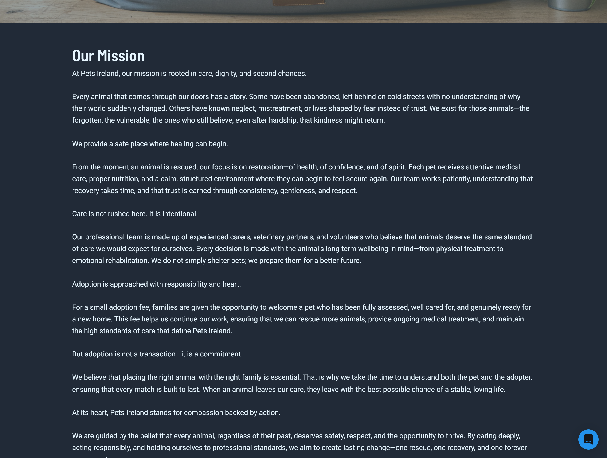
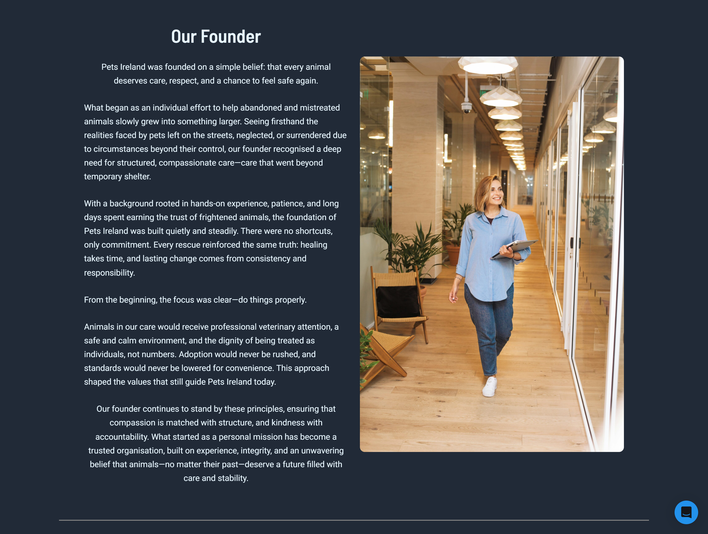
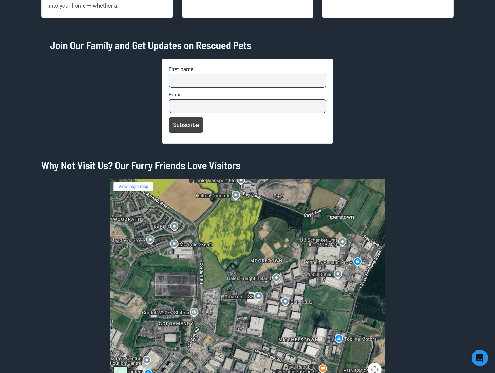
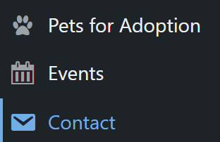
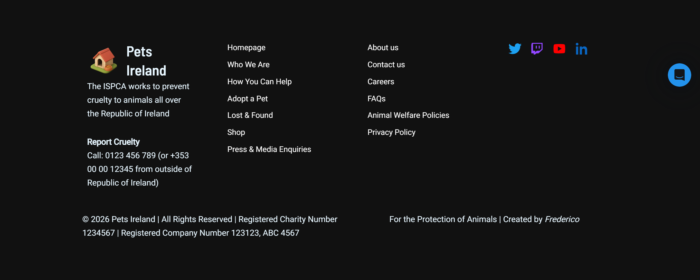

# Pets Ireland Website

A WordPress website built for Pets Ireland, combining custom PHP templates
with Elementor-based pages for flexible content management.

## Tech Stack & Tools

- WordPress
- Astra (Child Theme)
- PHP
- Elementor
- Advanced Custom Fields (ACF)
- Contact Form 7
- Custom Post Types (CPTs)
- Custom CSS
- Unsplash (for placeholder images)

## Key Pages

- Adoption Tips, Archive Event, Archive Pet and others (Custom PHP Template using WP_Query)
- Adoption Spotlight (Elementor layout)
- Static content pages built with Elementor

## What I Learned

- Building custom WordPress page templates
- Separating dynamic PHP-driven pages from visual Elementor pages
- Using flexbox concepts inside Elementor containers

## Screenshots

### Home

### Custom Post Type

### Footer

<!--  -->
