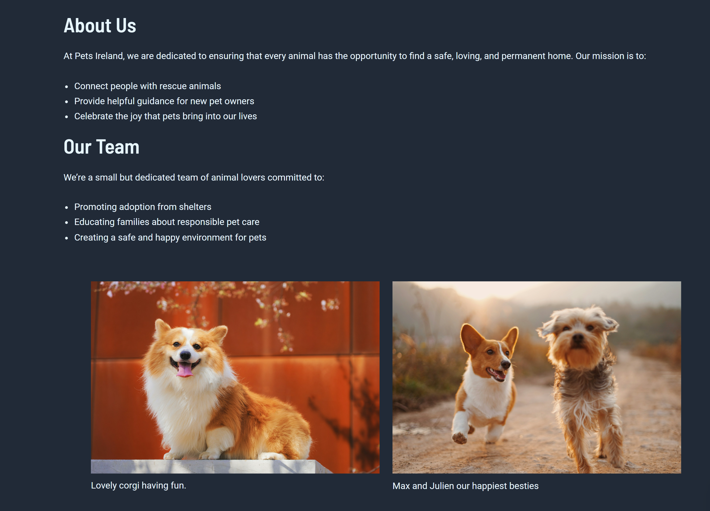
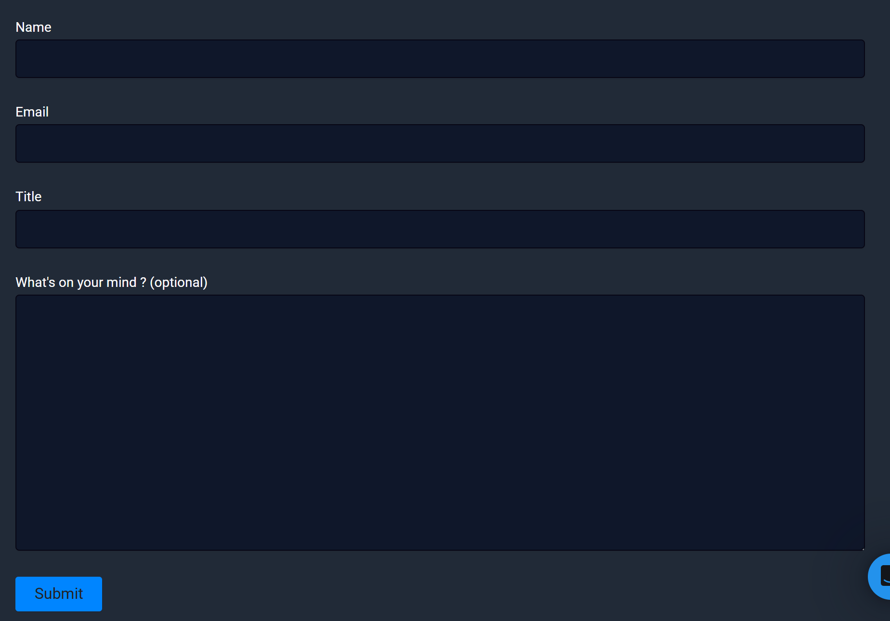

# Pets Ireland Website

A WordPress website built for Pets Ireland, combining custom PHP templates
with Elementor-based pages to support flexible and user-friendly content management.

## Tech Stack & Tools

- WordPress
- Astra (Child Theme)
- PHP
- Elementor
- Advanced Custom Fields (ACF)
- Contact Form 7
- Custom Post Types (CPTs)
- Custom CSS
- Unsplash (for placeholder images)

## Key Pages

- Adoption Tips, Event Archive, Pet Archive, and other dynamic pages built using custom PHP templates and `WP_Query`
- Adoption Spotlight page built with Elementor
- Static informational pages created using Elementor for easy editing

## What I Learned

- Building and registering custom WordPress page templates
- Separating dynamic, PHP-driven content from visual Elementor layouts
- Structuring layouts using Flexbox within Elementor containers
- Managing content through Custom Post Types and the WordPress admin dashboard

## Screenshots

### Home Page

### Custom Post Types (Admin Dashboard)

Custom post types were created to allow administrators to manage upcoming events and pet listings directly from the WordPress dashboard.

### About Page

### Footer

A fully customised footer built using the child theme to match the site’s branding.

### Contact Form

